# 睿颖 FG-4GT-2SX 2.5G 交换机定制管理固件

> **基于 RTLPlayground 二次开发 · 全中文图形化管理 · 开源免费发布**
> 开发者：**zakozako2233**


把一台百元级**非网管交换机**，变成带 **ACL 访问控制、链路聚合、风暴抑制、NTP 对时、登录防爆破、实时监控**的全能管理交换机。全部功能均已在真机（睿颖 FG-4GT-2SX，RTL8372N 芯片）实测通过。

---

## 目录

1. [这是什么？](#1-这是什么)
2. [为什么推荐它（强推理由）](#2-为什么推荐它强推理由)
3. [设备兼容性与规格](#3-设备兼容性与规格)
4. [对比一：它比"傻瓜交换机"强在哪](#4-对比一它比傻瓜交换机强在哪)
5. [对比二：相比其他固件/方案的改进](#5-对比二相比其他固件方案的改进)
6. [功能详解（全部功能）](#6-功能详解全部功能)
7. [网页界面逐页详解（配图）](#7-网页界面逐页详解配图)
8. [快速开始（3 步刷机）](#8-快速开始3-步刷机)
9. [固件下载 · 完整版本时间轴](#9-固件下载--完整版本时间轴)
10. [版本演进记录](#10-版本演进记录)
11. [常见问题 FAQ](#11-常见问题-faq)
12. [安全说明](#12-安全说明)
13. [开源与免责声明](#13-开源与免责声明)

---

## 1. 这是什么？

**睿颖 FG-4GT-2SX** 是市面上常见的一款 4×2.5G 电口 + 2×SFP 光口的 2.5G 交换机（基于 Realtek RTL8372N 交换芯片）。出厂只有基础的"即插即用"能力：**没有网页管理、没有 VLAN、没有聚合、没有安全策略**——插上网线能用，但什么都配不了。

本项目在开源项目 **RTLPlayground**（[github.com/logicog/RTLPlayground](https://github.com/logicog/RTLPlayground)）的基础上二次开发，为这块硬件定制了一整套**全中文、图形化、小白可上手**的管理固件，并针对 **4MB Flash** 与 **8051 处理器**做了大量性能优化。

**核心价值一句话：** 不用换交换机、不用加钱买网管机型，刷一个固件，这台 2.5G 交换机就能拥有网管交换机 90% 的日常功能，而且**全中文、手机电脑都能管**。

---

## 2. 为什么推荐它（强推理由）

| 亮点 | 说明 |
|---|---|
| **全网口 2.5G 全速率** | 4×2.5G 电口 + 2×SFP 光口，跑满 2.5G，不再受 1G 网管交换机的带宽瓶颈 |
| **全中文、小白可懂** | 图形化网页，每一项设置都有通俗说明，不用翻英文手册 |
| **静态链路聚合（XOR）** | 两条线路聚合成最高 5G 吞吐；**断线自动降级**单线路继续工作，不怕拔错一根线 |
| **主页实时 CPU 占用率** | 打开管理页就能看到交换机 CPU 负载，仅内存计算、**不写闪存、零磨损** |
| **登录防爆破** | 连续输错 5 次锁定 60 秒，暴力破解直接劝退 |
| **安全防护齐全** | 会话超时、命令注入防护、CSP、未认证接口一律 401 |
| **ACL / 风暴抑制 / NTP** | 全部**带独立开关**，关闭时**完全不占用性能** |
| **灯语实测修复** | 电口绿灯标准 link/act（链路常亮、有流量闪），黄灯标识 2.5G 速率 |
| **4MB 极省空间** | 手机版 / 电脑版界面按设备**二选一加载**，固件仅 512KB，省性能 |
| **永久免费开源** | 全部版本开源发布，含刷机说明与 MD5 校验 |

> 一句话总结：**花非网管交换机的钱，用上带 ACL、聚合、NTP、监控、防爆破的管理交换机。**

---

## 3. 设备兼容性与规格

| 项目 | 规格 |
|---|---|
| 品牌 / 型号 | 睿颖（RUIYING）FG-4GT-2SX |
| 交换芯片 | Realtek **RTL8372N**（内置 8051 MCU） |
| 存储 | 4MB SPI Flash（如 P25Q32SH / W25Q32） |
| 端口 | 4× 2.5G 电口（RJ45）+ 2× SFP 光口 |
| 管理地址 | `192.168.3.247`（固定） |
| 网关 | `192.168.3.1` |
| 登录方式 | 浏览器访问，密码登录（账号留空） |
| 默认密码 | `admin`（公开发布版通用密码） |
| 固件格式 | 512KB 升级包（在线刷）+ 4MB 整片镜像（编程器救砖） |

---

## 4. 对比一：它比"傻瓜交换机"强在哪

同样是这台机器、同一个价格档位，刷固件前后是**两种完全不同的设备**。下表逐项对比：

| 能力 | 傻瓜交换机（出厂状态） | 本固件（FG-4GT-2SX 定制版） |
|---|---|---|
| **网页管理界面** | ❌ 没有，插线即用、坏了只能拔线 | ✅ **全中文图形网页**，任何设置 3 步内点到 |
| **链路聚合（带宽叠加）** | ❌ 没有，双网口只走一条 | ✅ **静态 XOR 聚合**：双口叠加最高 5G，**断线自动降级不中断** |
| **VLAN 划分** | ❌ 没有 | ✅ 完整 VLAN：成员、Tagged/Untagged、PVID，隔离广播域 |
| **端口镜像（抓包）** | ❌ 没有 | ✅ 任意口 RX/TX/双向镜像到目的口 |
| **ACL 访问控制** | ❌ 没有，谁能访问全看接线 | ✅ 8 条硬件规则：按 MAC/IP/端口丢弃或放行 |
| **风暴抑制** | ❌ 没有——**环路风暴直接打瘫整个内网** | ✅ 广播/组播/未知单播/未知组播四类限速，超限硬件直接丢 |
| **NTP 时间同步** | ❌ 没有（断电时间就没了） | ✅ 自动对时，开机自动重新同步 |
| **登录密码 & 安全** | ❌ 没有管理面，谈不上安全 | ✅ 密码登录 + **5 次错锁 60s** + 会话超时 + 接口 401 门禁 |
| **实时状态监控** | ❌ 没有任何状态可见 | ✅ 主页 CPU 占用率 + 逐口速率 + 实时收发流量 PPS |
| **速率协商显示** | ❌ 灯亮了但不知道几 G | ✅ 逐口显示 10M/100M/1G/2.5G |
| **生成树（环路保护）** | ❌ 没有，物理环路=死网 | ✅ RSTP 802.1w，端口级启用/关闭 |
| **带宽限制** | ❌ 没有 | ✅ 逐口入/出方向限速（0.016–10000 Mbit/s），超限丢弃 |
| **EEE 节能** | ❌ 固定逻辑 | ✅ 逐口 100M/1G/2.5G 通告配置 |
| **MAC 地址表** | ❌ 看不到谁在通信 | ✅ 实时学习表 + 刷新/清除/筛选 |
| **指示灯语义** | 固定灯色，2.5G 黄灯经常不亮 | ✅ **绿灯 link/act、黄灯 2.5G**，寄存器级复刻原厂 |
| **配置持久化** | ❌ 无配置可言 | ✅ 保存到 Flash，重启自动恢复；日常运行零写入 |

**结论**：出厂它是一台"通电即用、其余全靠自觉"的交换机；刷完本固件，它具备入门网管交换机几乎全部日常能力，且**全是中文、全带说明、全带开关**。

---

## 5. 对比二：相比其他固件/方案的改进

市面上的同类方案（原厂固件、其他 RTLPlayground 改版、通用网管固件）常见问题与本品对照：

| 维度 | 其他固件/方案的常见缺陷 | 本固件的做法 |
|---|---|---|
| **界面语言** | 英文为主，术语晦涩 | **全中文 + 每项白话说明**，小白照着点即可 |
| **手机访问** | 部分浏览器登录直接 401、排版错乱 | **按 UA 自动进手机版**，手机/电脑二选一加载，根治 401 |
| **链路聚合** | 要么没有；要么只有"静态绑定"**断线不降级**；要么吹 LACP 却依赖芯片支持 | **XOR 静态聚合 + 断线自动降级**，多线程哈希最分散（MAC+IP+端口全字段） |
| **LED 灯语** | 寄存器没调对：灯乱亮、不亮、速率灯错位（本 PCB 绿灯收 LED0、黄灯收 LED1，不按此接线灯就反） | **寄存器级真机实测**：绿灯 link/act、黄灯 2.5G，电源灯/SYS 灯不动 |
| **登录安全** | 无防爆破，管理接口裸奔；弱口令随便试 | **5 次错锁 60s（HTTP 429+倒计时）**、会话超时、未认证一律 401 |
| **Web 安全** | 无 CSP、可注入 | CSP 策略、命令注入（`;`/`|`/`&&`/超长/空字节/路径穿越）双重拦截 |
| **ACL/风暴/NTP** | 要么没有；要么**常开占用 CPU** | 三项全带独立开关，**关闭时零性能占用**（硬件过滤链路） |
| **CPU 监控** | 要么没有；要么**写 Flash** 磨损闪存 | 仅内存计算，**永不落盘**，闪存寿命无忧 |
| **8051 性能** | 手机版电脑版同时渲染、卡死 | **二选一加载**，固件仅 512KB，8051 也能流畅跑 |
| **升级安全** | 无校验直接写，刷错就砖 | **CRC16（0xB001）校验**，失败自动回滚，防变砖 |
| **闪存寿命** | 频繁写配置/监控 | 仅"保存"时写一次，日常零写入；全片擦写寿命按 10 万次计可用几十年 |

**核心差异一句话**：别人给的是"能用"，我们给的是"**放心用**"——中文、安全、不磨损、不卡、断了线还自己顶上去。

---

## 6. 功能详解（全部功能）

### 6.1 管理界面（全中文 · 图形化）

- **全中文网页管理**：登录后所有页面、按钮、提示均为中文，每项设置旁都有白话说明
- **手机 / 电脑自适应**：按访问设备自动加载手机版或电脑版界面，**二选一、不同时渲染**——在 8051 上省出大量性能；手机浏览器不会出现 401 或排版错乱
- **主页实时仪表**：CPU 占用率、端口状态一目了然
- **浅灰清爽 UI**：界面美化，信息层级清晰，小白也能看懂
- **页面署名**：开发者署名 zakozako2233

### 6.2 网络与交换功能

- **静态链路聚合（XOR）**：
  - 支持 4 个聚合组、多口组合，吞吐叠加（2×2.5G → 最高 5G）
  - 聚合口**断线自动降级**为单线路继续工作，不中断业务
  - 聚合策略基于全字段哈希（源端口/源 MAC/目的 MAC/源 IP/目的 IP/源端口号/目的端口号），多线程场景分散最均匀
  - 注：LACP 动态聚合因 RTL8372N 芯片对协议帧硬过滤无法实现，详见 FAQ
- **端口管理**：逐口查看速率协商（10M / 100M / 1G / 2.5G）、收发计数、自协商开关、EEE 节能、MTU
- **VLAN**：完整保留 RTLPlayground 原生 VLAN 能力（VID/成员/Tagged/Untagged/PVID + 入方向过滤）
- **端口镜像**：抓包 / 监控场景可用（目的端口 + 逐口 RX/TX/双向）
- **IGMP 组播管理**：组播流量按需转发
- **生成树（STP）**：RSTP 802.1w 环路保护
- **MAC 地址管理**：地址表实时查询、刷新、清除、筛选
- **带宽限制**：逐口入/出方向限速（0.016–10000 Mbit/s），超限动作丢弃

### 6.3 安全防护

- **登录防爆破**：连续输错 5 次锁定 60 秒，锁定期拒绝一切尝试（HTTP 429），页面显示倒计时
- **会话超时**：5 分钟无操作自动退出登录
- **命令注入防护**：命令行接口 32 行上限、特殊字符过滤、路径穿越拒绝——`;`、`|`、`&&`、超长、空字节等全部拦截
- **ACL 访问控制**（带开关，关闭零占用）：
  - 支持 8 条规则，按源 / 目的 MAC、IP、协议、端口做**硬件级**转发控制
  - 命中规则由交换芯片直接丢弃或放行，**不经过 CPU**
- **未认证门禁**：所有数据接口（/information.json、/sec.json、/cmd、/config 等）未登录一律 401
- **Content-Security-Policy**：前端无 XSS 注入点

### 6.4 系统与运维

- **CPU 占用率实时显示**：主页直接看，仅内存计算，**不写闪存**
- **风暴抑制**（带开关，关闭零占用）：广播 / 组播 / 未知单播 / 未知组播四类分别限速（默认建议 10 Mbps），超限帧由硬件直接丢弃，防止环路风暴打瘫内网
- **NTP 时间同步**（带开关，关闭零占用）：填 NTP 服务器 IP 自动对时；芯片无电池时钟，断电清零、开机自动重新同步
- **Syslog 日志**：可配置服务器 IP 与端口，服务状态反映启动配置
- **配置持久化**：设置保存到闪存，重启自动恢复；日常运行零写入，闪存寿命无忧
- **固定管理 IP**：192.168.3.247，重启不丢
- **启动配置管理**：可查看/编辑启动配置命令（ip/gw/netmask/storm 等），占用显示 321/2048 字节，启动时自动重放

### 6.5 硬件灯语（真机实测）

- **绿灯**：标准 link/act —— 链路建立**常亮**，有数据传输**闪烁**
- **黄灯**：**2.5G** 链路点亮（1G / 低速不亮黄灯）
- **电源灯 / SYS 状态灯**：保持原厂逻辑，未改动
- 灯位经过多轮真机寄存器级调试，与原厂"黄灯 2.5G、绿灯 link/act"一致

---

## 7. 网页界面逐页详解（配图）

> 以下截图均来自真机运行的本固件（V5.9 系列），页面底部开发者署名为 zakozako2233。管理地址：`http://192.168.3.247`。

### 7.1 登录页

浏览器访问 `http://192.168.3.247` 即出现登录页：**账号留空，输入密码**（公开版默认 `admin`）。带防爆破：连续输错 5 次锁定 60 秒，页面显示倒计时；未认证直接访问任何数据接口一律 401。

### 7.2 仪表盘（主页）

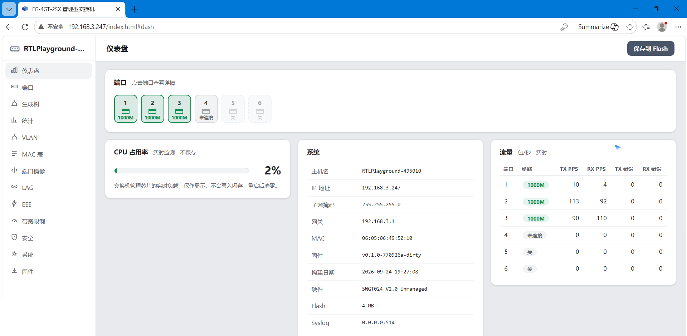

登录后第一眼看到的就是全部核心状态：

- **端口状态**：6 个口一排（1–4 电口、5–6 SFP），实时显示协商速率（1000M/2.5G/未连接/关），**点击端口可看详情**
- **CPU 占用率**：交换机管理芯片实时负载，**只显示、不写入闪存**，重启清零——不磨损 Flash
- **系统信息**：主机名、IP、掩码、网关、MAC、固件版本、构建日期、硬件型号、Flash 容量、Syslog 地址
- **流量统计**：逐口实时 TX/RX 包每秒（PPS）+ 收发错误包计数，一眼看出哪个口在跑流量

### 7.3 端口管理

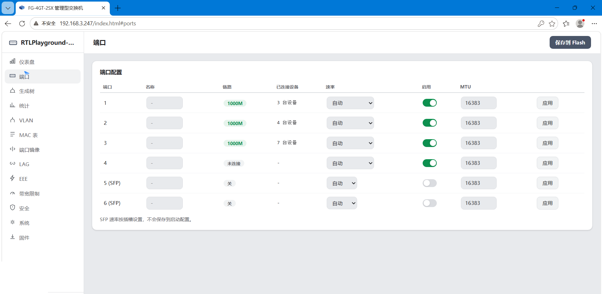

- 6 个口逐一列出：链路状态、名称、已连接设备数、速率、启用开关、MTU
- 电口可配置 **SFP 速率（按插槽）**、自协商、EEE
- 小白用法：插错口、线序不对，这里直接看出物理层有没有起来

### 7.4 生成树（STP）

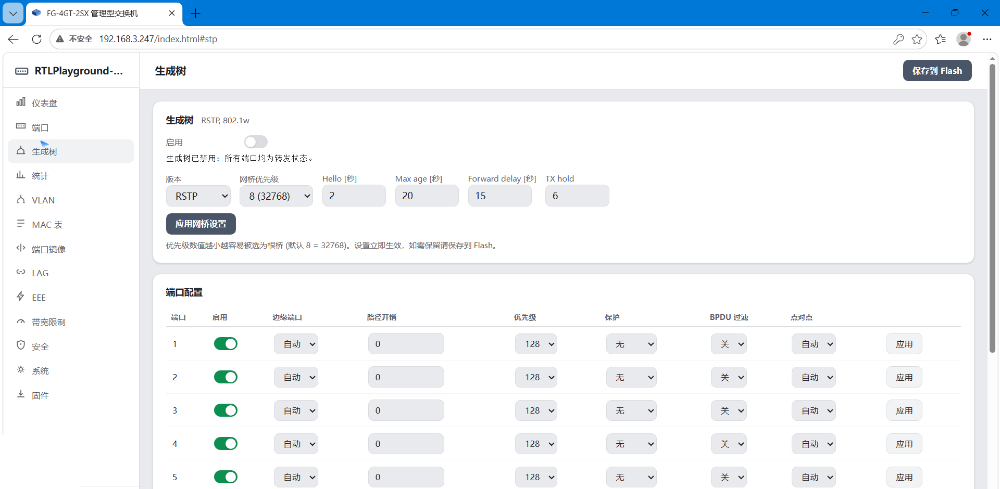

- **RSTP（802.1w）** 快速生成树：全局启用/关闭 + 逐端口配置
- 防止把交换机接成环（A 口接 B 口）导致广播风暴打瘫全网——**傻瓜交换机没这个能力，接环必死**
- 小白用法：家里多台交换机串联时开着它，随便怎么插线都不会自环

### 7.5 统计

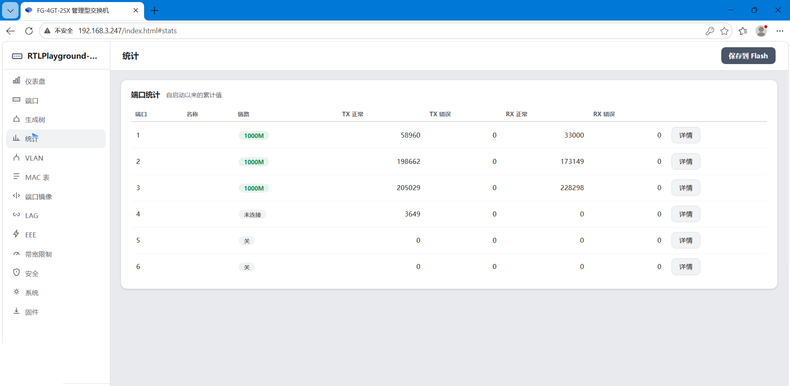

- 逐口累计 **TX/RX 字节、正常包、错误包**，实时刷新
- 排查方向：错误包暴涨 = 线材/协商/对端问题；广播包暴涨 = 查风暴

### 7.6 VLAN


- 完整 VLAN 管理：VID、成员口、Tagged / Untagged、PVID + 入方向过滤
- 典型用途：把摄像头、IoT 设备隔离到单独网段，谁也"看不见"谁，又共用一台交换机
- 附编辑器与入方向过滤配置

### 7.7 MAC 地址表

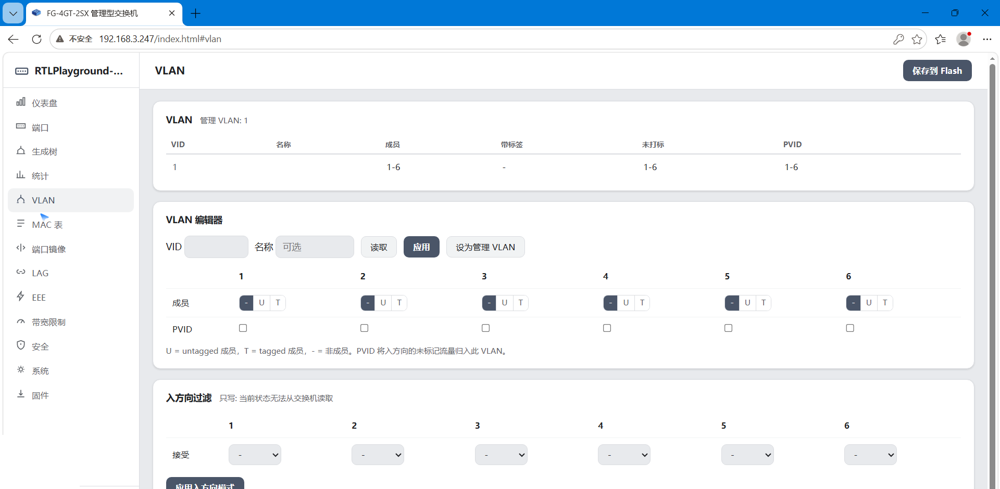

- 实时显示交换机学习到的 MAC 地址表（端口、VID、地址），支持**刷新 / 清除 / 筛选**
- 用途：确认某台设备到底插在哪个口（对账设备、找未知设备）

### 7.8 端口镜像

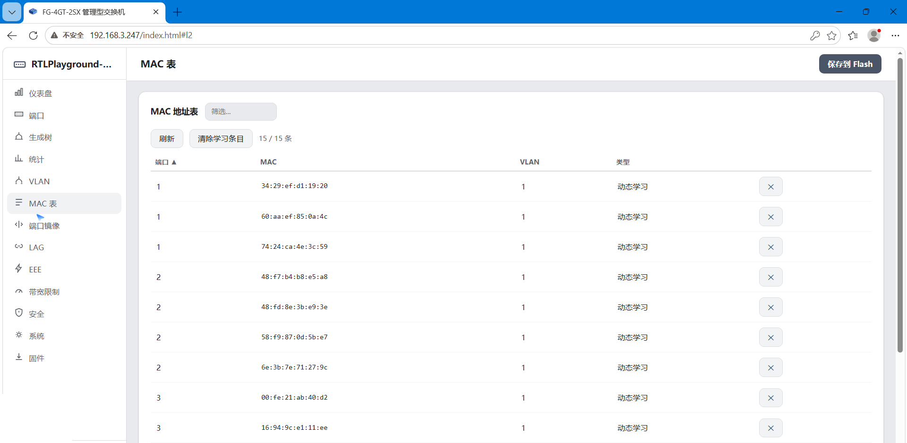

- 选择一个**目的端口**，再逐口勾选 **RX / TX / 双向** 镜像
- 用途：Wireshark 抓包、流量审计——把要监控的口"复印"一份到电脑所在的口
- 注意：双向 = 该端口的 RX 和 TX 都镜像到目的端口

### 7.9 链路聚合（LAG）★重点

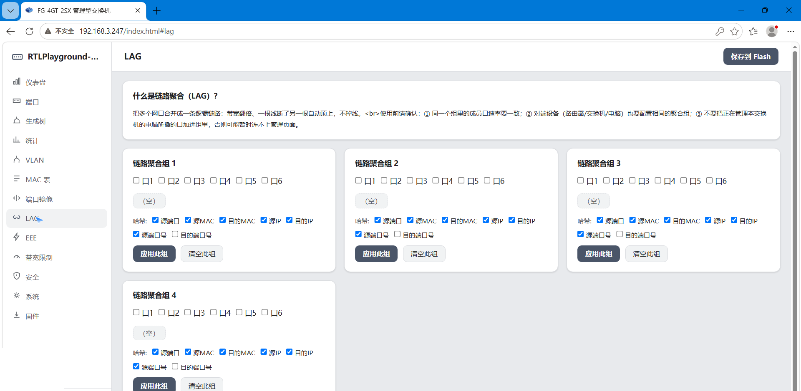

本固件最亮眼的功能之一：

- **4 个聚合组**，每组可勾选口 1–6 的任意组合（如勾口 1+2）
- **哈希策略可配置**：源端口 / 源 MAC / 目的 MAC / 源 IP / 目的 IP / 源端口号 / 目的端口号——全字段哈希让多线程负载最分散
- **应用此组 / 清空此组** 即时生效；应用空组 = 清除该组
- 组内一根线断开 → **自动降级单线路继续转发，不掉线**（业务无感）
- 页面内置小白须知：① 组内成员口速率要一致；② 对端（NAS/电脑）也要配相同聚合组；③ 别把正在管理本交换机的电脑所在口加进组，否则可能暂时连不上管理页
- 典型场景：NAS 双 2.5G 网口聚合 → 最高 5G 吞吐，跑满多盘阵列

### 7.10 EEE 节能以太网

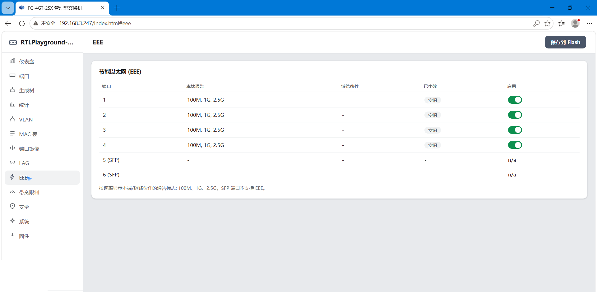

- 逐口显示**本端通告 / 链路伙伴 / 已生效 / 启用**
- 电口 1–4 支持 100M/1G/2.5G 节能通告；SFP 口（5/6）标注 n/a（光口不支持 EEE）
- 空闲时链路自动降功耗，省电降温

### 7.11 带宽限制

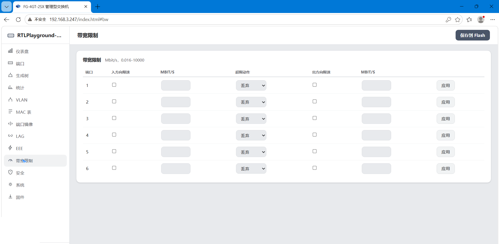

- 逐口设置**入方向限速 / 出方向限速**（0.016–10000 Mbit/s）
- 超限动作：**丢弃**
- 典型用途：限制某台设备（如监控摄像头、访客机）占满全带宽；给每户/每机封顶

### 7.12 安全（ACL + 风暴抑制 + NTP）★重点

**上：访问控制 ACL**

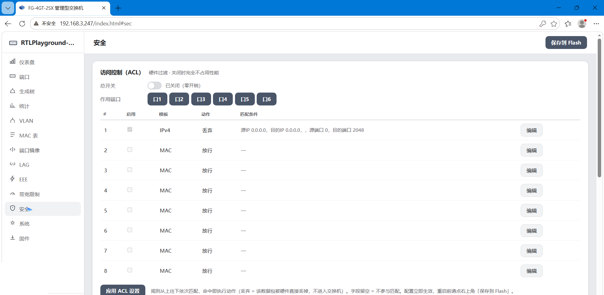

- 总开关 + 作用端口（口 1–6 可勾选）；**关闭时完全不占用性能**
- **8 条规则**：IPv4 / MAC 两种模板，动作为**丢弃 / 放行**，匹配源 IP、目的 IP、源端口、目的端口等
- 规则从上往下依次匹配，命中即执行（丢弃 = 硬件直接丢掉，不进入 CPU）；字段留空 = 不参与匹配
- 用途：禁止某设备互访、屏蔽指定 IP/端口、内网"防火墙"初体验

**下：风暴抑制**

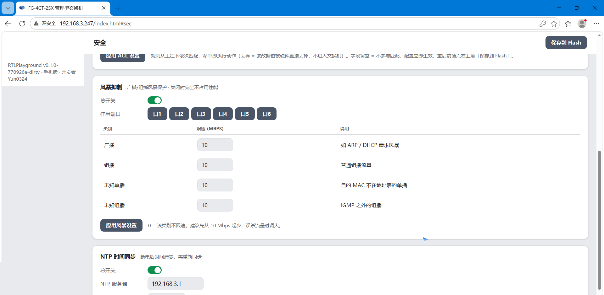

- 总开关 + 作用端口；**关闭时零占用**
- 广播（ARP/DHCP 风暴）、组播、未知单播、未知组播四类分别限速（默认建议 10 Mbps）
- 超限帧**由硬件直接丢弃**，不经过 CPU——环路/中毒风暴打不瘫全网
- 提示：0 = 该类不限速；误杀流量时把数值调大

**再下：NTP 时间同步**

- 总开关（**断电后时间清零，需重新同步**——本芯片无电池时钟）
- NTP 服务器 IP + 同步间隔（秒），开机/按间隔自动对时

### 7.13 系统设置

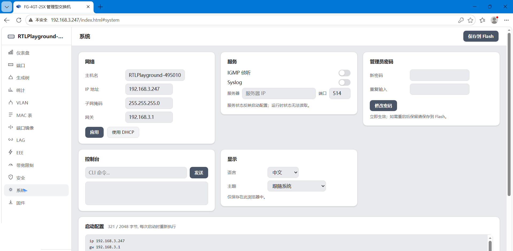

一站式管理，6 大块：

- **网络**：主机名、IP 地址、子网掩码、网关——可改静态 IP 或**一键使用 DHCP**；改完点"应用"
- **服务**：IGMP 侦听、Syslog（服务器 IP + 端口 514）
- **管理员密码**：新密码 + 重复输入 + 修改密码（立即生效；重启保留需保存到 Flash）
- **控制台（CLI）**：内置命令行接口，可输命令（带注入防护：32 行上限、特殊字符过滤、路径穿越拒绝）
- **显示**：语言（中文）、主题（跟随系统）
- **启动配置**：显示当前启动配置占用量（如 321 / 2048 字节），启动时自动重放 `ip / gw / netmask / storm enable / storm rate …`——这就是"重启不丢配置"的实现

### 7.14 固件升级

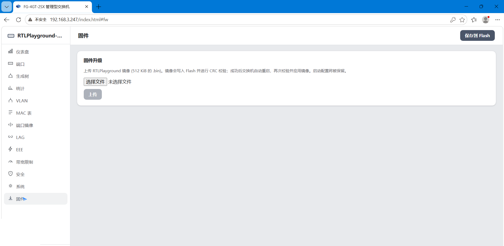

- 上传 RTLPlayground 镜像（**512 KiB 的 .bin**）
- 写入 Flash 前做 **CRC16 校验**，通过后自动重启、再次校验并应用；**启动配置自动保留**
- 校验失败自动回滚，**不会变砖**

---

## 8. 快速开始（刷机）

> ⚠️ 刷机有风险，请先完整阅读本节。**首次刷机注意：原厂是"傻瓜交换机"，没有网页管理页，必须用编程器写入；只有已经刷过本固件的机器，才能用网页在线升级。**

### 方式一：编程器首次刷机（必读）

**准备**：CH341A 编程器（或同类 SPI 编程器）、SOIC 测试夹 / 插座、配套软件（AsProgrammer、NeoProgrammer 等）

1. 断电，拆下外壳，找到 4MB SPI Flash 芯片（P25Q32SH / W25Q32 等，丝印多为 32M 位）
2. 编程器连接芯片（SOIC 夹免拆夹上，或取下芯片放入插座）
3. **先读取并保存原厂固件备份**——一旦变砖可直接写回恢复
4. 擦除整片 → 写入下载的 **512KB bin（从 Flash 起始地址 0x000000 写入）** → 校验一致
5. 断电取下编程器，装机通电
6. 电脑网线连任一电口，浏览器访问 `http://192.168.3.247`，密码 `admin` 登录即完成

> 无需 4MB 整片镜像：512KB 固件直接写 Flash 前 512KB 区即可。

### 方式二：网页在线升级（已刷过本固件的用户）

1. 电脑连交换机任一电口，浏览器访问 `http://192.168.3.247`
2. 输入密码 `admin` 登录（**账号留空**）
3. 进入「系统 / 升级」页面，选择下载的 `.bin` 文件上传
4. 等待约 30~40 秒，校验通过自动重启（约 1~3 分钟恢复），重新登录即完成

### 如何确认刷机成功

- 登录后主页显示「睿颖 FG-4GT-2SX 定制管理固件」及版本号
- 页面底部署名：zakozako2233
- 4 个电口插线后灯语正确（绿灯常亮 / 有流量闪烁，2.5G 黄灯亮）

### 救砖说明

- 网页升级通道带 **CRC16 校验**（0xB001）与自动回滚：校验失败自动退回旧固件，不会变砖
- 若彻底刷坏（如断电中断写片），用编程器重写**原厂备份**或 4MB 整片镜像即可恢复（见第 9 节说明）

---

## 9. 固件下载 · 完整版本时间轴

> 所有版本均为**公开发布版**：登录密码统一为 `admin`，均含开发者署名。在线升级请下载 **512KB** 文件。

### 最新版（推荐）

| 版本 | 文件 | 大小 | MD5 |
|---|---|---|---|
| **V5.9 稳定版** | `FG-4GT-2SX_rtlplayground_V5.9_公开版_稳定版.bin` | 512KB | `cd4c589bb55111d93e6965380a4de2b2` |

### 历史版本（时间轴 · 按发布时间顺序，均位于仓库 `older/` 目录）

| 版本 | 文件 | 主要变化 | MD5 |
|---|---|---|---|
| **V1 中文 UI 版** | `FG-4GT-2SX_rtlplayground_V1_中文UI版_公开版.bin` | 全中文界面 + 主页 CPU + 美化 | `9d85e166ea8274f19c61121982f9b09a` |
| **V2 手机版** | `FG-4GT-2SX_rtlplayground_V2_手机版_公开版.bin` | 手机端适配修复、根治 HTTP 卡死 | `8fa837f77da993cdf3ef4f976ab3680f` |
| **V4 静态聚合版** | `FG-4GT-2SX_rtlplayground_V4_静态聚合版_公开版.bin` | 静态 XOR 聚合 + 断线自动降级 | `fe28675f6b09a97fae9a671b73342994` |
| **V5 ACL/风暴/NTP 版** | `FG-4GT-2SX_rtlplayground_V5_ACL风暴NTP版_公开版.bin` | ACL + 风暴抑制 + NTP（带开关） | `050b03d6da8ba252bca6e792e236f1e1` |
| **V5.4 防爆破版** | `FG-4GT-2SX_rtlplayground_V5.4_防爆破版_公开版.bin` | 登录防爆破 + 会话超时 + 命令注入防护 | `f1f9d862c99fc66c4f3e590bb8a95181` |
| **V5.8 公开版** | `FG-4GT-2SX_rtlplayground_V5.8_公开版.bin` | 密码统一为 admin | `514f822203114780f4179703625b4070` |

> **版本说明**：
> - 最新版 `V5.9` 位于仓库根目录；历史版本均已归档到仓库 `older/` 文件夹。
> - 所有 512KB 文件均可直接在线升级；若需**编程器整片镜像（4MB）**用于救砖，可在 [Release 页面](https://github.com/zakozako2233/RTLPlayground-FG4GT2SX/releases) 下载历史刷机包。

---

## 10. 版本演进记录

```
2026-09 前期   V1 中文 UI 版      全中文图形界面上线：浅灰美化、主页 CPU 占用率、手机/电脑二选一加载
2026-09 前期   V2 手机版          修复手机浏览器 401、手机自动进手机版、根治 HTTP 服务卡死
2026-09 中期   V4 静态聚合版      静态 XOR 链路聚合落地：多口聚合、断线自动降级单线路
2026-09-24     V5 ACL/风暴/NTP    ACL 硬件过滤 + 风暴抑制 + NTP 对时，均带独立开关、关闭零占用
2026-09-25     V5.4 防爆破版      登录防爆破（5 次锁 60s）、会话超时、命令注入防护、CSP
2026-09-26     V5.6c 手机适配修复 手机端 UA 识别与根路径处理重写（内部里程碑，随 V5.7 起公开）
2026-09-27     V5.7 署名版        页面底部署名开发者（内部里程碑）
2026-09-27     V5.8 公开版        默认密码统一为 admin，正式公开发布
2026-09-27     V5.9 稳定版        电口 LED 寄存器级实测修复：绿灯 link/act、黄灯 2.5G 标识
```

### 每个版本做了什么

**V1 中文 UI 版**
- 全中文图形化界面（浅灰清爽 UI），告别英文固件
- 主页加入 CPU 占用率实时显示（内存计算，不写闪存）
- 手机版 / 电脑版按设备二选一加载，不同时渲染，节省 8051 性能
- 固定管理 IP 192.168.3.247

**V2 手机版**
- 修复部分手机浏览器登录 401 的问题
- 手机登录后自动进入手机版界面（可手动切回电脑版）
- 根治 HTTP 服务卡死（根路径处理改为安全查表，不再改写请求缓冲区）

**V4 静态聚合版**
- 静态链路聚合（XOR）：支持多口组合，吞吐叠加
- **断线自动降级**：聚合中一根线断开，自动降为单线路继续工作
- 聚合哈希覆盖 MAC + IP + 端口全字段，多线程负载最分散

**V5 ACL / 风暴抑制 / NTP 版**
- **ACL 访问控制**：8 条硬件规则（MAC / IP / 协议 / 端口），命中即硬件丢包或放行
- **风暴抑制**：广播 / 组播 / 未知单播四类限速，硬件直接丢弃超限帧
- **NTP 时间同步**：自动对时，开机自动重新同步
- 三项均带**独立开关**：关闭时完全不占用 CPU 与硬件资源

**V5.4 防爆破版**
- 登录防爆破：5 次错锁 60 秒（HTTP 429 + 页面倒计时）
- 修复锁定计时器：改用系统 tick（200Hz 单调计数器）
- 修复重启锁定残留：断电重启自动清零
- 会话超时真实化：5 分钟无操作自动退出
- 命令注入防护：命令行接口 32 行上限、特殊字符过滤、路径穿越拒绝
- 前端安全：Content-Security-Policy、API 401 门禁

**V5.8 公开版**
- 默认密码统一调整为 `admin`（公开版不携带任何私人密码）
- 保留 V5.7 及之前全部功能与署名

**V5.9 稳定版（最新）**
- 电口 LED **寄存器级实测修复**：确认该 PCB 绿灯引脚收 LED0 信号、黄灯引脚收 LED1 信号，复刻原厂 LED 引擎配置（GLB_IO_EN=0x7624155b）
- 绿灯：标准 link/act —— 链路建立常亮、有数据传输闪烁
- 黄灯：2.5G 链路点亮（1G / 低速不亮）
- 电源灯、SYS 灯保持原厂逻辑，未改动

---

## 11. 常见问题 FAQ

**Q1：LACP 为什么不行？**
A：RTL8372N 芯片对 LACP 协议帧（目的 MAC `01:80:C2:00:00:02`）做**硬件过滤**，协议帧根本到不了 CPU，LACP 无法在该芯片实现（真机实测确认）。本固件采用 **XOR 静态聚合**：NAS / PC 侧选择静态 / XOR 聚合模式即可获得同样的带宽叠加效果。

**Q2：聚合跑不满怎么办？**
A：聚合按流哈希分配，**单条连接只会走一条物理链路**。要求对端也双口聚合 + 多线程并发（如 `iperf3 -P 4`、NAS 多任务）才能跑近 5G。本固件哈希已覆盖 MAC + IP + 端口全字段，是最分散的配置。

**Q3：SFP 光口怎么用？**
A：插入标准千兆 / 2.5G SFP 模块即可正常使用，无需额外配置。

**Q4：闪存寿命？**
A：配置仅在保存时写入闪存，日常运行**零写入**；CPU 占用率等监控数据只存内存。按每天保存 10 次配置、闪存 10 万次擦写寿命计算，可用几十年。

**Q5：刷机会变砖吗？**
A：升级通道带 **CRC16 校验**（文件必须通过 0xB001 校验才会写入），校验失败自动回滚旧固件。唯一风险是**刷机途中断电**——请确保供电稳定。

**Q6：可以恢复原厂固件吗？**
A：可以。原厂固件备份后可通过同升级页刷回；或使用编程器整片写入原厂镜像。

**Q8：傻瓜交换机也能用这个固件吗？**
A：本固件针对**睿颖 FG-4GT-2SX（RTL8372N）**定制。同芯片的其它品牌 4×2.5G+2×SFP 机器理论上可刷，但**灯语、端口布局需按各自 PCB 实测**，请勿直接硬刷不同硬件。

---

## 12. 安全说明

- 登录页带 Content-Security-Policy，无 XSS 注入点
- 所有数据接口（/information.json、/sec.json、/cmd、/config 等）均要求登录，未认证一律 401
- 命令注入（`;`、`|`、`&&`、超长、空字节、路径穿越）在认证层与解析层双重拦截
- 登录防爆破：5 次失败锁定 60 秒
- 默认密码 `admin`，请登录后及时修改
- 本固件仅用于局域网管理，不建议直接暴露公网

---

## 13. 开源与免责声明

本项目基于开源项目 **RTLPlayground**（[github.com/logicog/RTLPlayground](https://github.com/logicog/RTLPlayground)）二次开发，保留上游全部能力并在此基础上增强。固件源码与发行版持续迭代中。

**免责声明**：本固件为个人开源定制项目，刷机有风险，请自行评估后使用。作者不对因刷机造成的任何硬件损坏或数据丢失负责。

**开发者：zakozako2233**
